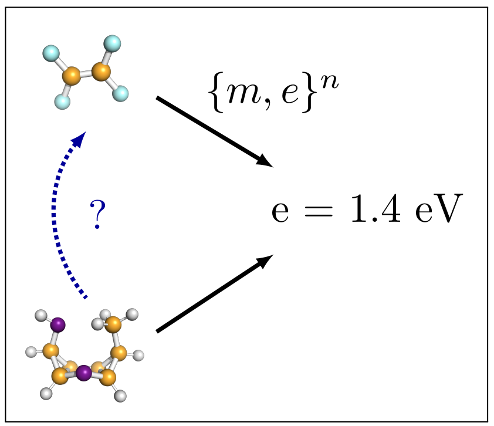
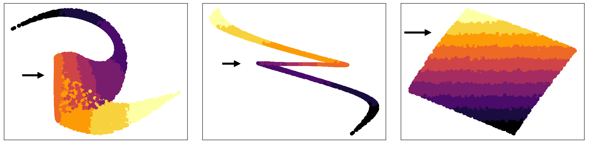

# Inverse Learning of Symmetries

This repository contains a basic implementation of our NeurIPS 2020 paper [Inverse Learning of Symmetries](https://arxiv.org/pdf/2002.02782.pdf). 

<p align="center">
  
</p>


## Requirements

The code was tested under Python 3.6.5. To run the code, it is necessary to install the following dependencies from the requirements file.

Open a new terminal and create a virtualenv:
```
mkdir symmetries
cd symmetries
git clone https://github.com/bmda-unibas/InverseLearningOfSymmetries.git
cd ..
virtualenv symmetries/paper
```

Activate the environment:
```
source symmetries/paper/bin/activate
```
Install the dependencies:
```
pip install -r symmetries/InverseLearningOfSymmetries/requirements.txt
```

## Training

To train the artificial experiment in the paper, run this command:

```train
python Main.py --mode train --model STIB --pretrained <path_to_saved_model>
```
You can decide between to following models:

- VAE
- STIB_WO_REG
- CVAE
- CVIB
- STIB

## Evaluation

To evaluate the artificial experiment, run this command:

```eval
python Main.py --mode evaluate --model STIB --save_path <path_to_pretrained_model>
```

You can decide between to following models:

- VAE
- STIB_WO_REG
- CVAE
- CVIB
- STIB

## Pre-trained Models

You can find the pretrained models here: [Models](pretrained/)


## Results

Here we report the results of our basic implementation:

### Qualitative Results

<p align="center">
  
</p>

The left figure depicts the latent space of VAE where the first two dimensions are plotted. In contrast, the middle figure shows the latent space of STIB that was trained without our regulariser. Here, the first invariant dimension Z_0 (x-axis) is plotted against the dimension of Z_1 (y-axis). The right figure illustrates first dimension of the invariant latent space Z_0 (x-axis) plotted against Z_1 (y-axis) after being trained by our method. Horizontal coloured lines in the bottom right panel indicate invariant with respect to the target Y. In remaining panels the stripe structure is broken. Black arrows denote the invariant direction.

### Quantitative Results
| Model name         | X MAE  | Y MAE | MI(Z0,Y) |
| ------------------ |---------------- | -------------- | -------------- |
| VAE   |     0.21         |      0.49       | 3.89  |
| STIB W/O ADV.   |     0.01         |      0.65       | 3.19 |
| CVAE   |     0.33         |      -       | 2.57 |
| CVIB   |     0.67         |      -       | 2.45 |
| STIB   |     0.04         |      0.47       | 0.25 |


## Reference


If you like our paper and use it for your research, please cite us.

```
@incollection{Wieser,
title = {Inverse Learning of Symmetries},
author = {Wieser, Mario and Parbhoo, Sonali and Wieczorek, Aleksander and Roth, Volker},
booktitle = {Advances in Neural Information Processing Systems 34},
year = {2020}
}
```